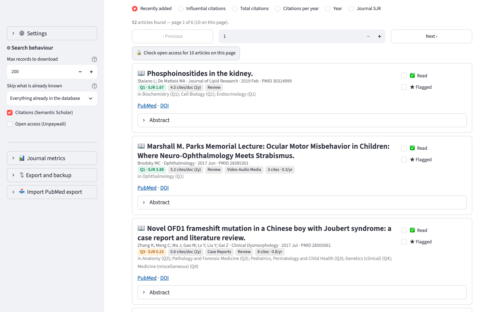
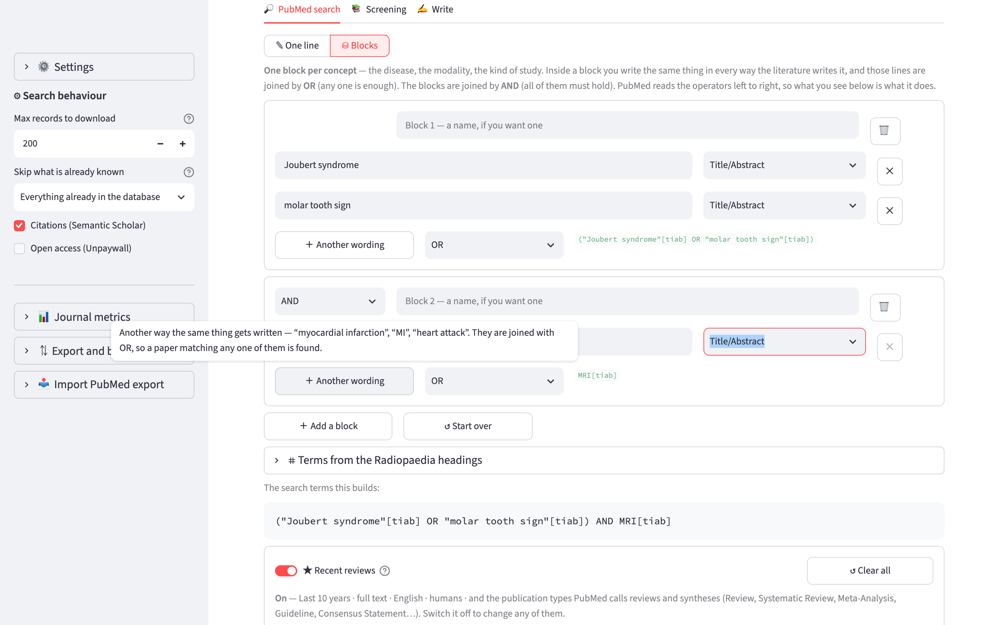

<div align="center">

# Radiowriter

[](https://pypi.org/project/radiowriter/)
[](LICENSE)
[](#install)
[](https://www.python.org/)
[](https://gmadevs.github.io/Radiowriter/)
[](https://github.com/gmadevs/Radiowriter/actions/workflows/test.yml)
[](https://github.com/gmadevs/Radiowriter/actions/workflows/docs.yml)

</div>

Find the literature for a [Radiopaedia.org](https://radiopaedia.org) article,
screen it, and write the article against it.

Search PubMed one line at a time or build the query concept by concept. Rank
what comes back by how much it is cited and by where it was published. Sift it
down with the filters, keep what is worth keeping in reading lists, then write
the article — with the section structure Radiopaedia recommends for that kind
of article, the citations resolved for you, their own linter run over your
draft, and the formatted HTML their editor expects.

Runs on macOS, Linux and Windows. Nothing leaves your computer except the
searches themselves.

> Unofficial. Not affiliated with or endorsed by Radiopaedia.org.



## Install

Radiowriter is a Python program that serves a page to your own browser. One
command installs it, one command runs it — the same on macOS, Linux and
Windows.

```bash
uv tool install radiowriter
```

```bash
radiowriter
```

It opens `http://localhost:8501` in your browser. `Ctrl+C` in the terminal
stops it. `uv tool upgrade radiowriter` updates it, and
`uv tool uninstall radiowriter` removes it — your archive stays where it is.

<details>
<summary>If you do not have <code>uv</code></summary>

macOS and Linux:

```bash
curl -LsSf https://astral.sh/uv/install.sh | sh
```

Windows, in PowerShell:

```powershell
powershell -c "irm https://astral.sh/uv/install.ps1 | iex"
```

`pipx install radiowriter` does the same job if you already have pipx.

</details>

> **Want what is on `main` instead of the last release?**
> `uv tool install git+https://github.com/gmadevs/Radiowriter` installs straight
> from the repository — no index, no account, whatever is on the branch right
> now. [How releasing works](docs/develop/release.md).

## First run

It asks for an email address, and says why: PubMed and Unpaywall both want a
contact address in every request, so they can warn whoever is calling instead
of silently blocking them. There is nothing to register for, and the address
stays on your computer.

Three other things are optional and can wait: an NCBI API key (raises the rate
limit from 3 to 10 requests a second), a Semantic Scholar key (faster citation
lookups), and your library's LibKey ID (direct full-text links through your
subscription).

### Journal quartiles

To see journal quartiles and SJR, download the CSV from
[scimagojr.com](https://www.scimagojr.com/journalrank.php) — *Download data*,
top right — and drop it in the folder that `radiowriter --where` prints. Any
name starting with `scimagojr` works; the app picks the most recent one it
finds and matches your articles by ISSN.

The file is not bundled: SCImago's data is CC BY-NC, and it is a new file every
year.

> **This is not the Journal Impact Factor.** That one is Clarivate's and lives
> in the JCR. SCImago gives *SJR*, which weighs citations by the prestige of
> the journals making them, and *cites/doc (2y)*, which is computed like an
> impact factor but over Scopus. Both are shown, both are labelled.

## What it does



**Search.** PubMed syntax on one line, or the block builder: one block per
concept, every wording of it inside joined by OR, the blocks joined by AND.
The ISSG published search filters for guidelines and evidence syntheses are
built in. So is a generator that turns the section headings of a Radiopaedia
article into search strategies — `Epidemiology` becomes prevalence and
incidence, `MRI` becomes the MeSH terms and the words for magnetic resonance.

**Screen.** The archive, filtered by read, flagged, reading list, journal
quartile, and sorted by citations or by SJR. Full text through LibKey if your
library has it, through Unpaywall if there is a legal free copy. Reading lists
you make, rename and delete; an article can be in several at once, and an
article in a list is never purged.

**Write.** A Markdown editor that knows the twenty-three section structures
Radiopaedia recommends and can insert the ones your kind of article should
have. Cite with `[@27859258]` — the identifier itself — and the numbering is
worked out at export from the order of first appearance. Radiopaedia's own
linter rules run over the draft. Two buttons copy the article and the
reference list as rich text, so headings, bold and the `<sup>` markers survive
the paste into their editor.

## Where your data lives

One SQLite file, in the place your system keeps user data:

| | |
|---|---|
| macOS | `~/Library/Application Support/Radiowriter` |
| Linux | `~/.local/share/radiowriter` |
| Windows | `%LOCALAPPDATA%\Radiowriter` |

`radiowriter --where` prints it. `RADIOWRITER_HOME=/some/path radiowriter`
overrides it, which is how you keep an archive on an external disk.

`⇅ Export and backup` in the sidebar writes a `.nbib` (the articles, in
PubMed's own format, readable by any reference manager) or a `.json` (the whole
archive, to move it to another computer). The `.json` deliberately leaves your
settings out, so a backup you share does not carry your email or your keys.

## Running from source

```bash
git clone https://github.com/gmadevs/Radiowriter.git
cd Radiowriter
python3 -m venv .venv && . .venv/bin/activate
pip install -e .
radiowriter
```

The tests need no network and no configuration:

```bash
python3 check_rules.py       # the Radiopaedia linter rules
python3 check_structure.py   # the article structures
python3 check_search.py      # query building, ISSG filters, strategies, lists
python3 check_journals.py    # SCImago, journal matching, Unpaywall, backups
python3 check_app.py         # the interface, driven without a browser
```

`check_mesh_live.py` is the one exception: it asks PubMed whether every MeSH
term the strategies use still exists. Run it when you change them, or when MeSH
changes — once a year, in January.

## Documentation

**[gmadevs.github.io/Radiowriter](https://gmadevs.github.io/Radiowriter/)**

| | |
|---|---|
| [Install and first run](docs/guide/install.md) | Getting it going, and the SCImago file |
| [Search PubMed](docs/guide/search.md) · [in blocks](docs/guide/blocks.md) | The filters, and building a query concept by concept |
| [Screen](docs/guide/screen.md) · [journals](docs/guide/journals.md) | Reading lists, quartiles, open access |
| [Write](docs/guide/write.md) | Structures, citations, the linter |
| [Backup](docs/guide/backup.md) | Moving to another computer |
| [How it works](docs/internals/architecture.md) | Architecture, storage, the services it calls |
| [Known limitations](docs/limitations.md) | What it does not do, written down |

## Licence

[AGPL-3.0-only](LICENSE).

The Radiopaedia article structures in `radiowriter/data/article-structure.json`
and the linter rules in `radiowriter/data/lint-rules.json` are transcriptions
of Radiopaedia's own published guidance, not ours. Journal metrics come from
[SCImago](https://www.scimagojr.com/), CC BY-NC.
