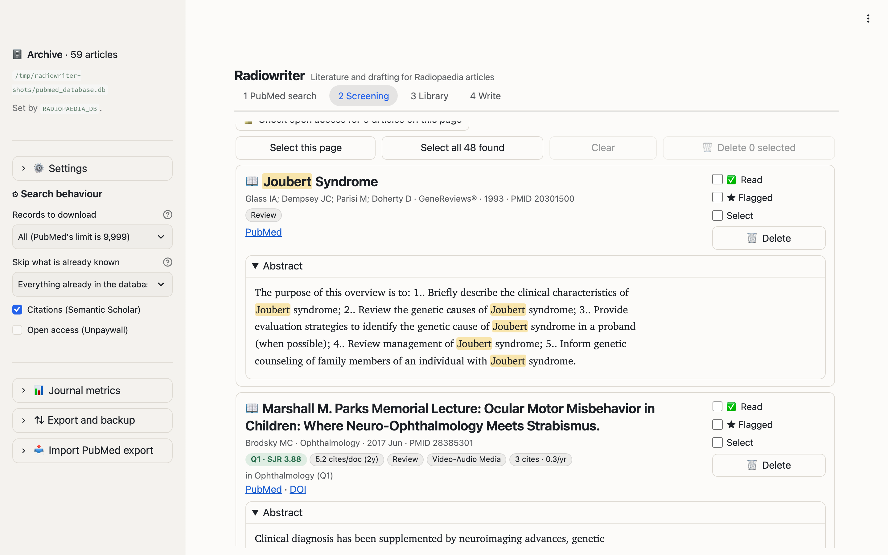
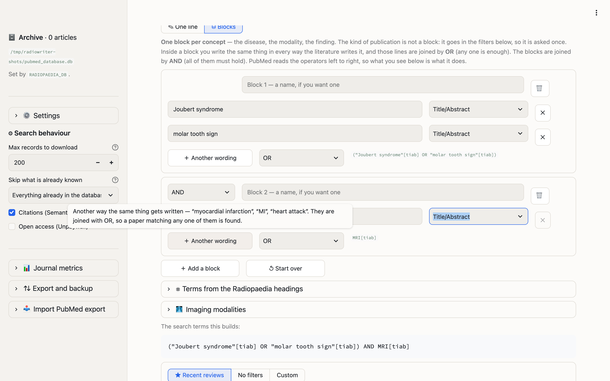

<div align="center">

<picture>
  <source media="(prefers-color-scheme: dark)" srcset="https://raw.githubusercontent.com/gmadevs/Radiowriter/main/docs/public/banner-dark.png">
  
</picture>

[](https://pypi.org/project/radiowriter/)
[](LICENSE)
[](#install)
[](https://www.python.org/)
[](https://gmadevs.github.io/Radiowriter/)
[](https://github.com/gmadevs/Radiowriter/actions/workflows/test.yml)
[](https://github.com/gmadevs/Radiowriter/actions/workflows/docs.yml)

</div>

Radiowriter searches PubMed, helps you screen the results, and gives you an
editor for writing a [Radiopaedia.org](https://radiopaedia.org) article from
them.

You can type a PubMed query on one line or build it in blocks, one per concept.
Results can be sorted by citation count or by journal rank (SJR), filtered, and
saved in reading lists. The editor inserts the section structure Radiopaedia
recommends for the type of article, numbers the citations at export, runs
Radiopaedia's linter rules on the draft, and produces the HTML their editor
accepts.

It runs on macOS, Linux and Windows. The archive is stored on your computer.
The only network requests are the searches and the lookups listed in
[The services it calls](docs/internals/services.md).

> Unofficial. Not affiliated with or endorsed by Radiopaedia.org.



## Install

Radiowriter is a Python program that serves a page to your own browser. The
commands are the same on macOS, Linux and Windows.

Install it:

```bash
uv tool install radiowriter
```

Run it:

```bash
radiowriter
```

It opens `http://localhost:8501` in your browser. `Ctrl+C` in the terminal
stops it. `uv tool upgrade radiowriter` updates it.
`uv tool uninstall radiowriter` removes the program and leaves your archive in
place.

<details>
<summary>If you do not have <code>uv</code></summary>

macOS and Linux:

```bash
curl -LsSf https://astral.sh/uv/install.sh | sh
```

Windows, in PowerShell:

```powershell
powershell -c "irm https://astral.sh/uv/install.ps1 | iex"
```

If you already have pipx, `pipx install radiowriter` also works.

</details>

To install the current state of the `main` branch in place of the last
release, use `uv tool install git+https://github.com/gmadevs/Radiowriter`.
See [How releasing works](docs/develop/release.md).

## First run

The first screen asks for an email address. PubMed and Unpaywall require a
contact address in every request, and use it to reach you if your requests
cause a problem. You do not have to register anywhere, and the address is
stored only on your computer.

Three other settings are optional and can be added later:

- an NCBI API key, which raises the rate limit from 3 to 10 requests a second;
- a Semantic Scholar key, which makes citation lookups faster;
- your library's LibKey ID, which gives direct full-text links through your
  library's subscription.

### Journal quartiles

Quartiles need no setup. A copy of the SCImago table for 2025 is included, and
articles are matched to it by ISSN.

To use a newer year, click *Download data* (top right of the table) on
[scimagojr.com](https://www.scimagojr.com/journalrank.php) and put the CSV in
the folder that `radiowriter --where` prints. A file whose name starts with
`scimagojr` is used in place of the included copy. Then open
**📊 Journal metrics** in the sidebar and click
**↻ Reload the file and re-match**.

The included copy is SCImago's data, used under
[CC BY-NC](https://creativecommons.org/licenses/by-nc/4.0/). It has been
reduced to the 10 columns the app reads and to the rows of type "journal".
`radiowriter/data/scimagojr-2025.about.txt` records the source, the download
date and what was removed.

> **These metrics are not the Journal Impact Factor.** The Impact Factor is
> published by Clarivate in the JCR. SCImago gives *SJR*, which weights
> citations by the rank of the citing journal, and *cites/doc (2y)*, which is
> calculated like an impact factor but on Scopus data. The app shows both,
> each with its label.

## What it does



### Search

Type PubMed syntax on one line, or use the block builder. A block holds one
concept. The terms inside a block are joined by OR, and the blocks are joined
by AND.

The ISSG published search filters for guidelines and evidence syntheses are
included.

A generator turns the section headings of a Radiopaedia article into search
strategies. For example, `Epidemiology` becomes terms for prevalence and
incidence, and `MRI` becomes the MeSH terms and text words for magnetic
resonance.

Search terms for 43 imaging modalities are included. *Doppler ultrasound*, for
example, adds the MeSH descriptors, `doppler`, `duplex`, both spellings of
"colour", and the resistive index.

### Screen

The archive can be filtered by read, flagged, reading list and journal
quartile, and sorted by citations or by SJR. Full text opens through LibKey if
your library subscribes, or through Unpaywall if a legal free copy exists.

You can create, rename and delete reading lists, and an article can be in
several lists. Articles marked read are deleted from the archive at the next
start, except those in a list or with a PDF in the library.

### Keep the PDFs

The library holds one PDF per article, named
`Author Year - Journal - Title [PMID n].pdf`. Free copies are downloaded
directly. A PDF you downloaded yourself, for example through LibKey, can be
dropped into the app, which finds its article by DOI or title in the archive
or on PubMed. Highlights made in the app's reader are listed with a checkbox
each.

### Write

The Markdown editor includes the 23 section structures Radiopaedia recommends
and inserts the one for your type of article.

Cite with the PubMed identifier, `[@27859258]`. At export the citations are
numbered in order of first appearance.

Radiopaedia's linter rules run on the draft. Two buttons copy the article and
the reference list as rich text, so that headings, bold and the `<sup>`
markers are kept when you paste into Radiopaedia's editor.

The study window shows the Radiopaedia page you are editing next to a PDF and
its highlights.

## Where your data is stored

The archive is one SQLite file in the user data folder of your system:

| | |
|---|---|
| macOS | `~/Library/Application Support/Radiowriter` |
| Linux | `~/.local/share/radiowriter` (or `$XDG_DATA_HOME/radiowriter`) |
| Windows | `%LOCALAPPDATA%\Radiowriter` |

`radiowriter --where` prints the folder. To use another folder, for example on
an external disk, set `RADIOWRITER_HOME`:

```bash
RADIOWRITER_HOME=/some/path radiowriter
```

**⇅ Export and backup** in the sidebar writes one of two files:

- a `.nbib` file with the articles, in PubMed's format, which reference
  managers can import;
- a `.json` file with the whole archive, for moving it to another computer.

The `.json` file does not contain your settings, so a backup you share does
not include your email address or your keys.

## Running from source

```bash
git clone https://github.com/gmadevs/Radiowriter.git
cd Radiowriter
python3 -m venv .venv && . .venv/bin/activate
pip install -e .
radiowriter
```

The tests need no network and no configuration:

```bash
python3 check_rules.py       # the Radiopaedia linter rules
python3 check_structure.py   # the article structures
python3 check_search.py      # query building, ISSG filters, strategies, lists
python3 check_journals.py    # SCImago, journal matching, Unpaywall, backups
python3 check_library.py     # PDF library, highlights, the Radiopaedia list
python3 check_app.py         # the interface, driven without a browser
```

`check_mesh_live.py` needs the network. It asks PubMed whether every MeSH term
used by the strategies still exists. Run it when you change the strategies,
and each January, when MeSH is updated.

## Documentation

The full documentation is at
[gmadevs.github.io/Radiowriter](https://gmadevs.github.io/Radiowriter/).

| | |
|---|---|
| [Install and first run](docs/guide/install.md) | Installation, settings, the SCImago file |
| [Search PubMed](docs/guide/search.md) · [in blocks](docs/guide/blocks.md) | The filters, and building a query one concept at a time |
| [Screen](docs/guide/screen.md) · [journals](docs/guide/journals.md) | Reading lists, quartiles, open access |
| [PDFs and the study window](docs/guide/library.md) | The PDF library, highlights, Radiopaedia next to a PDF |
| [Write](docs/guide/write.md) | Structures, citations, the linter |
| [Backup](docs/guide/backup.md) | Moving to another computer |
| [How it works](docs/internals/architecture.md) | Architecture, storage, the services it calls |
| [Known limitations](docs/limitations.md) | What the app does not do |

## Licence

[AGPL-3.0-only](LICENSE).

The Radiopaedia article structures in `radiowriter/data/article-structure.json`
and the linter rules in `radiowriter/data/lint-rules.json` are transcriptions
of Radiopaedia's published guidance.

`radiowriter/data/scimagojr-2025.csv.gz` contains journal metrics from
[SCImago Journal & Country Rank](https://www.scimagojr.com/), derived from
Elsevier's Scopus and used under
[CC BY-NC 4.0](https://creativecommons.org/licenses/by-nc/4.0/). The file is
redistributed with only the columns the app reads. The values are SCImago's
and are unmodified. The `.about.txt` file next to it records the download date
and what was removed. **The NonCommercial term applies to that file**,
whatever licence terms you follow for the rest of the code.
